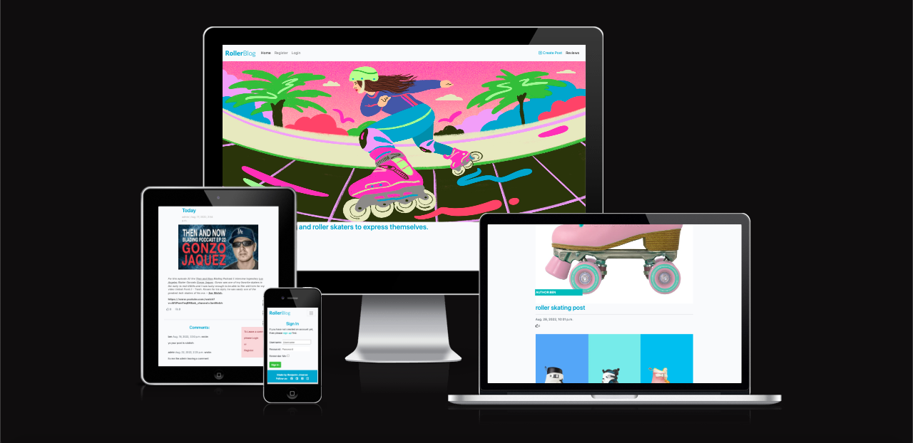

# The Roller Blog

A blog for inline skaters, big wheels, racing, agressive and everything else iline skating related.
you can share for example images, ideas and spots to go skate to.

tech used: django, django summernote, presql.

live link

## Features

### the Navbar

1. roller blog logo:

    

    the roller blog logo present on all the pages and links you back to the home page
    
2. home:

    present on all the pages and links you back to the home page

3. register:

    

    - the register link apears when the user hasn't registered or logged in and takes you to the register form
    - the sign up page features username, email, and password with a sign in option if you already have registered
    

4. login:

    

    - the login apears only if you haven't logged in or registered
    - the login/ sign up section features a username input as well as the password with an option to sign up if        you haven't yet 
    

5. logout:

    

    - the logout only appears on the navbar if the user has logged in
    - you can then logout/ sign out by clicking on the button and it will redirect you to the homepage.
    

6. Create Post:

    

    - redirects you to the create a post page (see below for details)
    
6. reviews:

    

    - takes you to the reviews page where you can check previous reviews and add your own. As long as you have sign up and logged in
    - the review page is there to leave an impression of the whole blog and it gives you a space to request the administrators about the website
    
    

### the main roller artwork

a colourful artwork with a rollerblader
to catch people's attention
 

### Create post

a button takes you to a page to create a post for the blog

the Create post page allows the user to post their own news or/and idea about rollerskating or inline skating.
the user can then choose a title for there post a text content and an image and then either publish or draft the post.

### the blog

- the list of blog posts with a default image with 3 different type of skates
    here if the user hasn't uploaded their own.
    features the post title, the post time and date as well as a featured photo that could be chosen by the user*

- you also have featured in the blog posts the amount of thumbs up people left

- and a site pagination set to 5 posts per page to keep it clean and clear

### blog post detail

- each blog post is a link to the post detail page where you can read more about the post, like it with a thumbs up and commment on it as well.
- the user need to be signed in to comment and the comment need to be approved by admin first. 

### the comment section

section on the post detail page where you can post comments about the post

### warning messages

    - warning messages when the user hasn't sign in

    - when the user sign in or sign out or sign up

    

### bottom of the page

various social links 

### tasks github templates

    - i have used the agile template on github to follow the tasks needed for the project

# models

i created three models

1. class post 

2. class comment 

3. class review

# Testing

i have manualy manually and automatically tested this project by doing the following

* automatic testing the create form and review form in **test_form.py**
* manual testing on links and buttons and pagination.

## bugs
    several issues with the slug on the create post
    CreatePost had a conflict
    *issues wiring up the user photo from the create post form 

### solved bugs
    added the save function in the model.py to automatically attach the slug to the post title
    imported the CreateView method following django docs 

## remaining bugs
    issues wiring up the image input in the create post form. only available via the admin panel at the moment.
    i need to figure out how to connect it with the cloudinary database.

## validator testing
    - html checker no fault found

    - css checker no fault found

    - pep8: Checked all python code and all is right

# deployment

this project was deployed using heroku

* step for deployment
 * fork or clone this repository
 * create a new heroku app
 * link the heroku app to the repository
 * click on deploy

# Credit

* based on the code institute codestar blog

* exerpts from rollernews.com

* then and now rollerblading podcast

